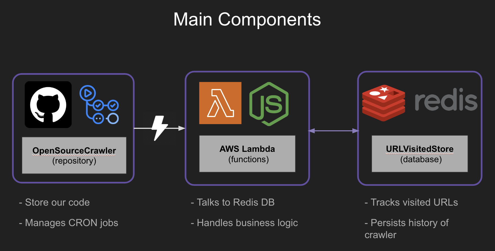
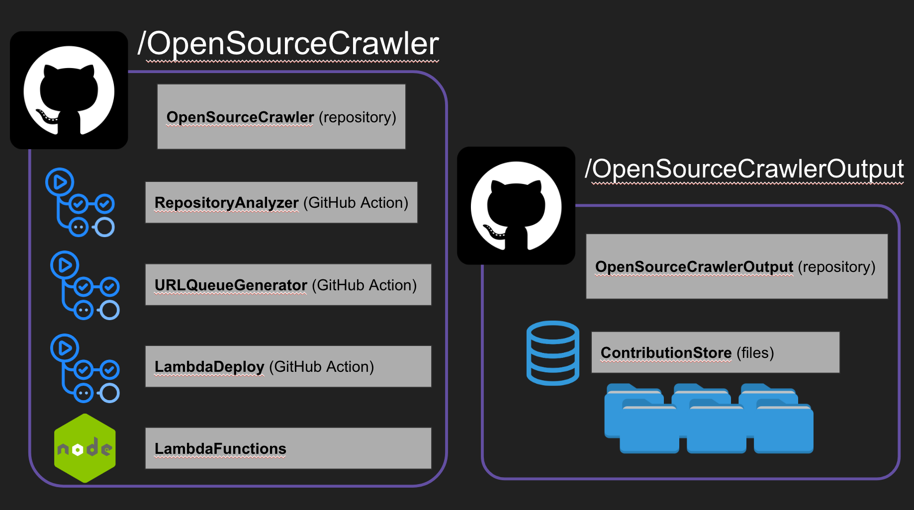
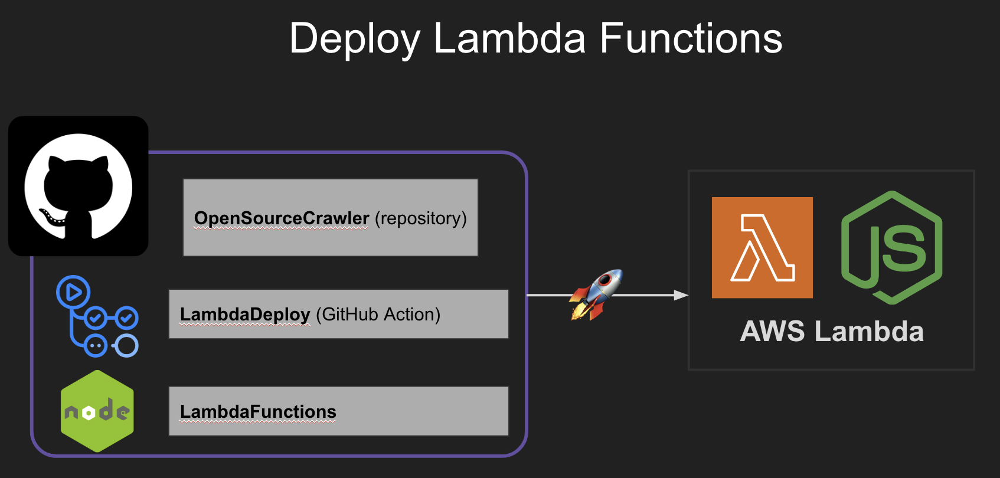
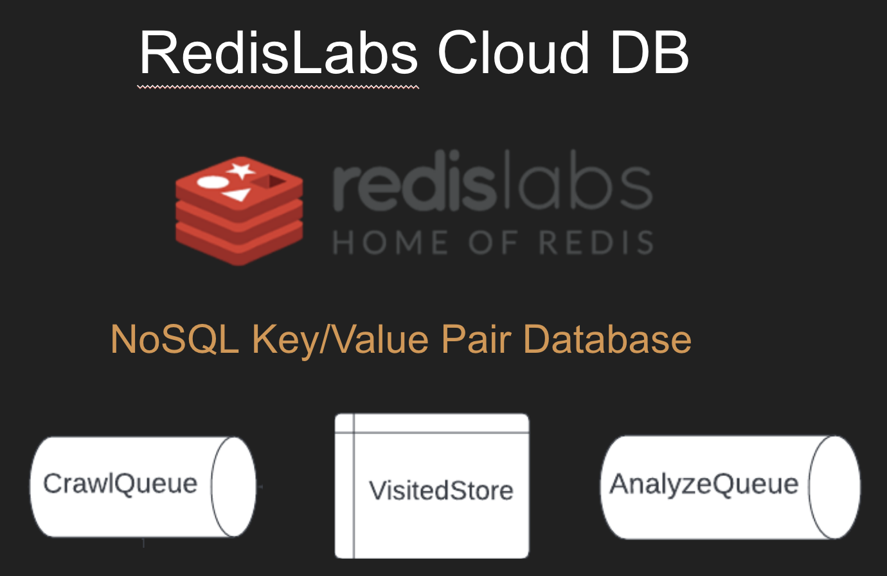
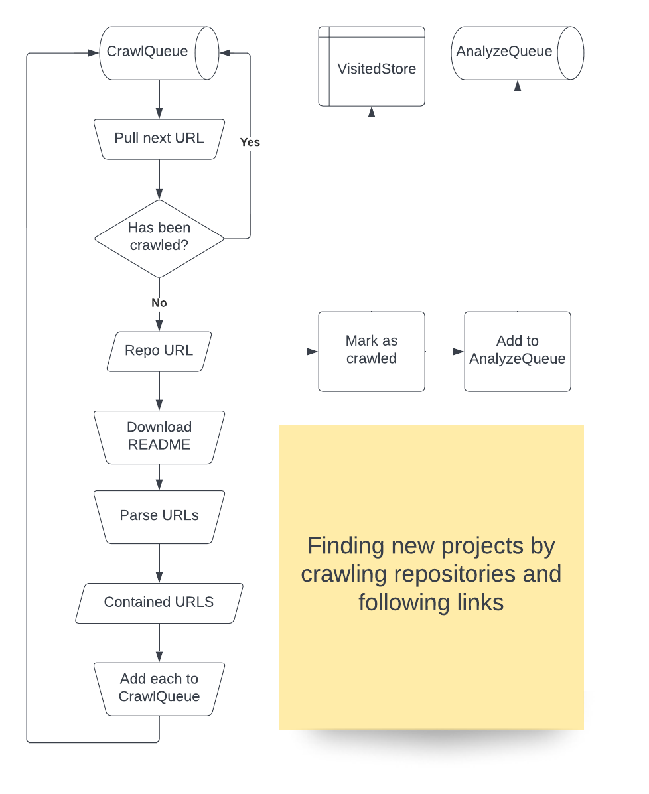
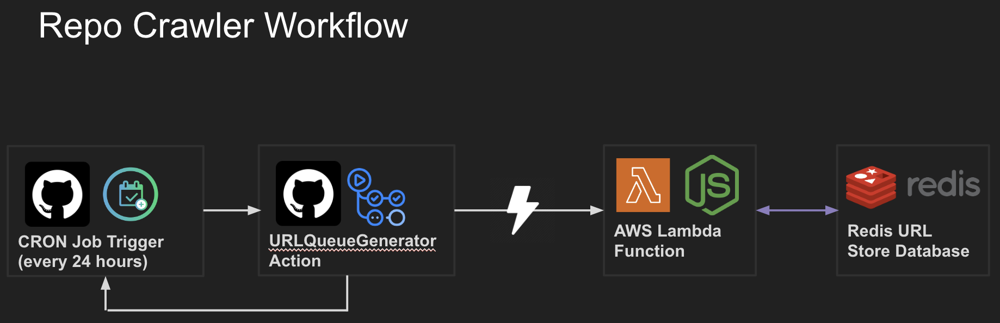
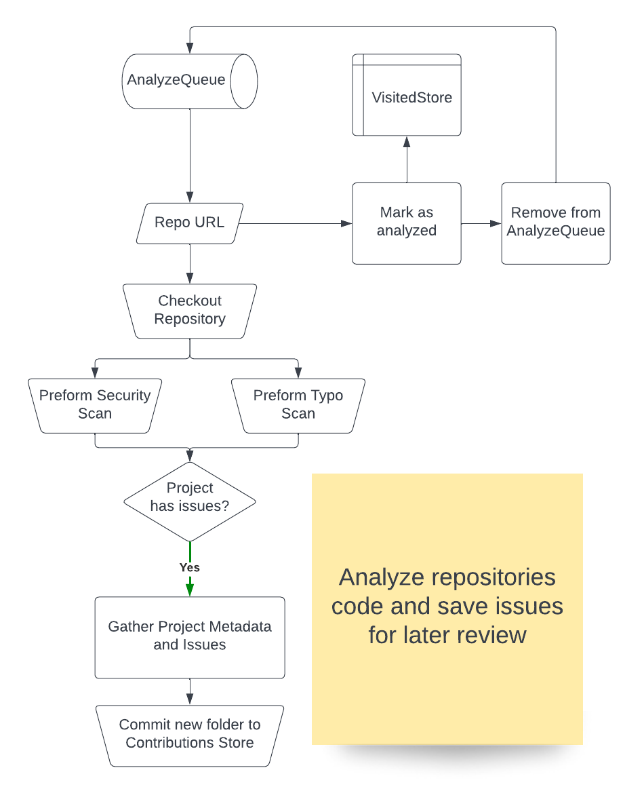
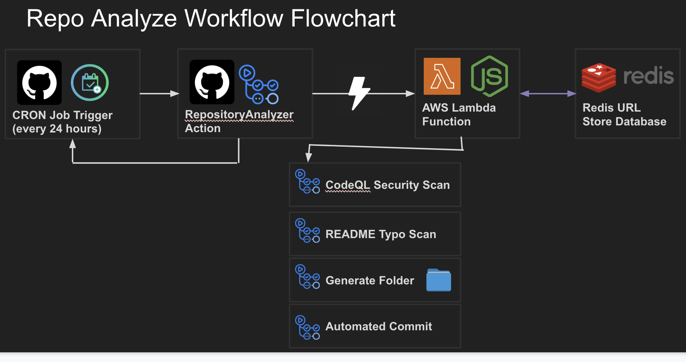

# Open Source Repository Web Crawler 🕷

   

GitHub Repository web crawler and security scanner to streamline my contributions to open source on GitHub. 

Uses scheduled GitHub Actions invoking AWS Lambda functions connected to Redis database.

## 🌟 How It's Built

- Development Process - [Blog Post](TODO) | [Medium Post](TODO)
- Project Walk-through - [Youtube Video](TODO)
- Project Walk-through Slideshow - [Google Slides](https://docs.google.com/presentation/d/1sANVXPe05rDFzKI7B5r8jIwC-Qpg4v47SLCIn9kdRBA/edit?usp=sharing)

## 🧰 Technologies
- [GitHub Actions](TODO)
- [Node.js](TODO)
- [AWS Lambda](TODO)
- [Redis](TODO)

## Documentation

- [Installation](docs/installation.md)
- [Getting Started](docs/getting-started.md)
- Components:
  - [GitHub Actions](docs/actions.md)
  - [Lambda Functions](docs/lambda.md)
  - [Repository Secrets](docs/secrets.yml)

## Diagrams

