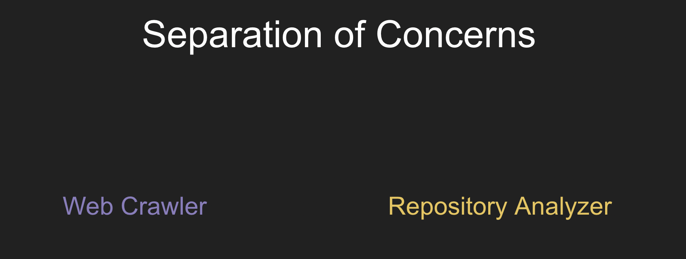
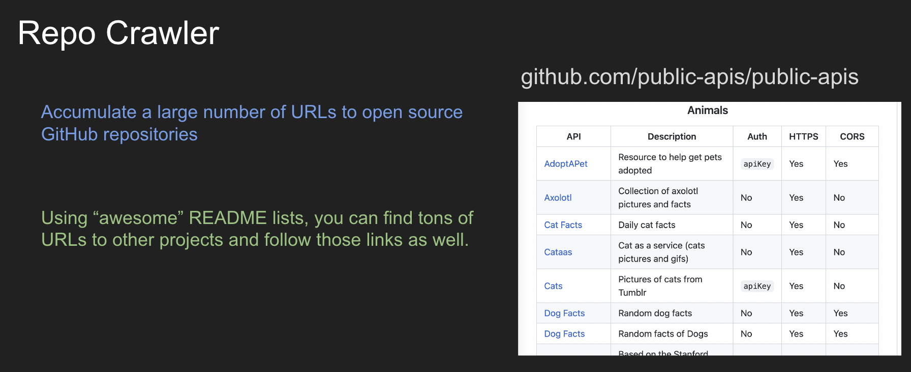
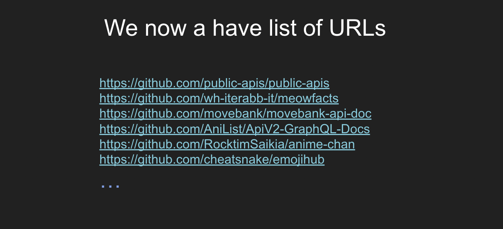

# Open Source Repository Web Crawler 🕷

Web crawler to browse GitHub open source repositories, scan for typos and vulnerabilites, and store all findings. Built with GitHub Actions, AWS Lambda, and RedisDB.

   

## 🧰 Technologies
- [GitHub Actions](https://github.com/features/actions)
- [Node.js](https://nodejs.org/en)
- [AWS Lambda](https://aws.amazon.com/lambda/)
- [Redis](https://redis.io/)

## 📄 Documentation

- [Installation](docs/installation.md)
- [Getting Started](docs/getting-started.md)
- Components:
  - [GitHub Actions](docs/actions.md)
  - [Lambda Functions](docs/lambda.md)
  - [Repository Secrets](docs/secrets.yml)

## 📊 Diagrams

